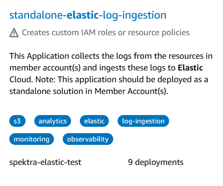
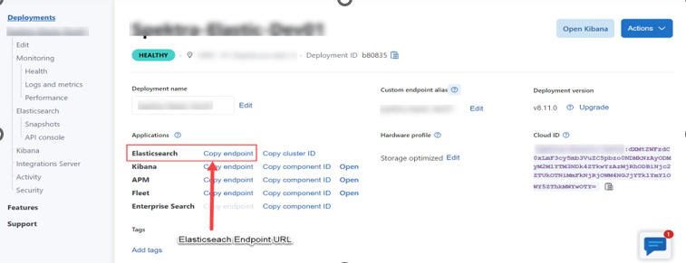
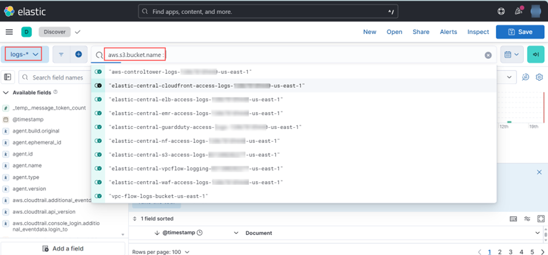
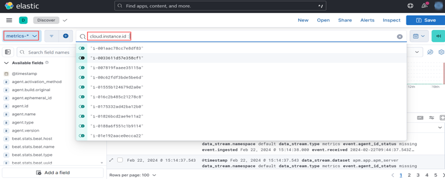

# Elastic-ingest-accelerator-standalone

<!-- TOC -->

1. [Solution Overview](#solution-overview)
2. [Architecture](#architecture)
3. [Prerequisites](#prerequisites)
4. [Implementation Guide](#implementation-Guide)
5. [How Each Log Input is Collected and Sent to Elastic](#how-each-log-input-is-collected-and-sent-to-elastic)
6. [Deployment Flow](#deployment-flow)
7. [Technical details](#technical-details)
8. [Deployment Steps](#deployment-steps)
9. [Deployment Overview and Resource Configuration Details](#deployment-overview)


<!-- /TOC -->

## Solution Overview

Elastic is the leading platform for search-powered solutions, and aiding organizations, their employees, and their customers in finding what they need faster, while keeping applications running smoothly, and protecting against cyber threats. Amazon Web Services (AWS) logs are collected within an account (**which is a component of an AWS Organization**) and subsequently transmitted to Elastic Cloud. Log Ingestion to the Elastic cloud is done using the Elastic Serverless Forwarder.


1. **AWS Organization**: Ensure that your AWS account is part of an AWS Organization. The Organization ID will be required during the application deployment process.

1. **Setting up Elastic Cloud**:  It is imperative to have an Elastic account and deploy a cluster where the logs will be directed. This cluster serves as the destination for the logs, enabling analysis and visualization of the data.

1. **Deploying the Application from the Serverless Application repository**: In the final step, you will deploy the serverless application from the Serverless Application Repository (SAR) within your AWS account. This deployment process will create essential resources, including S3 buckets, SQS queues, Kinesis Firehose delivery streams (if enabled for log ingestion), KMS keys, Secrets Manager configurations, installation of Elastic Agent on EC2 instances (if chosen for EC2 metric ingestion), VPC endpoints (for deploying Elastic Serverless Forwarder within a VPC), and the deployment of the Elastic Serverless Forwarder itself. Once the application is deployed, proceed to configure the post-deployment setup and verify the appearance of logs within the Elastic Cloud environment.

This process ensures that all AWS service logs are collected from their respective destinations and seamlessly routed to Elastic Cloud deployment using the Elastic Serverless Forwarder.

## Architecture

The following architecture diagram outlines high-level components involved in ingesting logs from various AWS Services to Elastic Cloud.

1. **Member Account(s)**:This account, which is part of an AWS organization, hosts AWS resources such as Elastic Load Balancer, Network Firewall, CloudFront, and Route 53. These resources generate logs that are sent to destinations such as S3 buckets (for ELB logs, Network Firewall logs, CloudFront logs, etc.), CloudWatch log groups, Kinesis Data Streams, Kinesis Firehose delivery streams, and EC2 instance metrics collections. With the help of the Elastic Serverless Forwarder, logs from S3 buckets, Kinesis Data Streams, and CloudWatch log groups are transmitted to Elastic Cloud.

This architecture ensures that logs from various AWS services are efficiently collected in a central place and then sent to the Elastic Cloud for analysis and visualization.


## Prerequisites

1. **Configuring the AWS CloudTrail Bucket (Required):**: AWS CloudTrail is a service that meticulously records AWS API calls associated with your account and delivers the corresponding log files to an S3 bucket. It is essential to activate this service to facilitate the transmission of logs to the designated S3 bucket. For comprehensive guidance on configuring a trail within your account, please consult the official AWS documentation: [Configuring AWS CloudTrail](https://docs.aws.amazon.com/awscloudtrail/latest/userguide/cloudtrail-create-and-update-a-trail.html).

   **Note**: Ensure that a S3 bucket has been configured to collect CloudTrail logs, as the bucket name and ARN will be required during the application deployment process.

1. **Amazon Security Lake logs (Optional):**: If you are intending to ingest security lake logs/findings into the Elastic deployment, ensure that Security Lake is enabled beforehand and retain the Security Lake Bucket ARN and SQS ARN. Once Security Lake is enabled, you must *update the timeout setting for the Security Lake SQS queue to 910 seconds* before deploying the application.

1.  **Configure Log Ingestion Sources:**
    - Before launching the application from the Serverless Application Repository, ensure that you have the appropriate configurations for the AWS resources from which logs will be ingested.

        - **AWS Kinesis Data Stream:** If you plan to ingest Kinesis data stream logs into Elastic Cloud, ensure that the Kinesis data streams are created prior to deploying this application and keep the Kinesis Data Stream ARN readily available.

        - **AWS CloudWatch Logs:** To ingest CloudWatch logs into Elastic Cloud, ensure that the CloudWatch log group is created before deploying this application and keep the CloudWatch Log Group ARN handy.

        - **Ingesting EC2 Instance Metrics:** If you intend to ingest EC2 instance metrics into Elastic Cloud, ensure that you have the following details available: Subnet ID (with internet access), VPC ID, Deployment Version, Deployment ID, Elasticsearch Username, Elasticsearch Password, and Kibana URL. These details are necessary for generating the enrollment token during the installation of the Elastic agent on the EC2 instance.

1. **Prepare the Networking Infrastructure, if deploying the Elastic Serverless Forwarder in VPC (Optional):**
    - If you are deploying the Elastic serverless forwarder within an Amazon VPC, ensure that the VPC is properly configured. Subnets should be configured without direct routes to the internet. This ensures enhanced security by limiting external access.
    - Utilizing private link connections for ingesting AWS services logs into Elastic. This setup ensures secure and direct communication between AWS services and Elastic without exposure to the public internet.
    - *Note*: If you intend to deploy the elastic serverless forwarder in a VPC, it is imperative to provide the subnet IDs where the forwarder will be deployed. To achieve this, create subnets in the availability zones with corresponding availability zone IDs where the private link service is supported. Failure to adhere to this requirement will result in a failed application deployment. Please refer to the official Elastic Search documentation [Elastic PrivateLink](https://www.elastic.co/guide/en/cloud/current/ec-traffic-filtering-vpc.html) to obtain the list of supported availability zones and their respective zone IDs where the subnets should be created. This note is of utmost importance for ensuring the successful deployment of the application.

Once these prerequisites are met, you can proceed with launching the application from the Serverless Application Repository.
Please ensure you review and follow any additional guidelines provided by the documentation for the services you are using, as this will help avoid common pitfalls and ensure a smoother setup process.


## Implementation Guide

### Implementation Overview

If you do not have **Control Tower set up** in your AWS environment, you can utilize our standalone application named *"standalone-elastic-log-ingestion"* which is available in the Serverless Application Repository.

Note - Your AWS account must be part of an AWS Organization, as the organization ID will be required during the application deployment process.

We have considered the following inputs for log ingestion.

- AWS CloudTrail logs
- Amazon S3 Access logs
- Amazon ELB logs
- Amazon VPC Flow logs
- AWS Kinesis Data Stream
- AWS CloudWatch logs
- AWS GuardDuty logs
- Amazon Ec2 logs
- AWS Network Firewall logs
- Amazon WAF logs
- Amazon CloudFront logs
- Amazon EMR Cluster logs
- Amazon Security Lake logs
- AWS SQS Management Event logs via CloudTrail
- AWS Lambda logs via CloudTrail
- AWS Inspector logs via CloudTrail
- Security Hub logs via CloudTrail
- Amazon Elastic Container Service logs via CloudWatch
- Amazon Route 53 logs via CloudWatch
- Amazon API Gateway logs via CloudWatch


You can enable Amazon Kinesis Firehose Delivery Stream to directly ingest logs into Elastic Cloud. The following log ingestion is supported by the Amazon Kinesis Firehose Delivery Stream.

- AWS CloudFront logs
- EC2 logs in AWS CloudWatch
- Amazon Elastic Load Balancing logs
- AWS Network Firewall logs
- Amazon Route 53 logs
- Amazon S3 server access log
- AWS VPC flow logs
- AWS WAF Logs

## How Each Log Input is Collected and Sent to Elastic

Each log input is collected and sent to Elastic using different mechanisms and services in AWS. Here is a summary of how each log input is collected and sent to Elastic:

### AWS CloudTrail
For AWS CloudTrail, a *dedicated S3 bucket must be configured as a prerequisite* to collect logs from the account and AWS regions. This S3 bucket will be created to store the CloudTrail logs.

The Elastic Serverless Forwarder utilizes an SQS-based S3 input mechanism to pull these logs. Whenever new objects are detected, notifications are sent to SQS, triggering the forwarder. Subsequently, the forwarder polls the queue to identify new log items, which are then ingested into Elastic Cloud from the S3 bucket.

### S3 Access Logs
Logs are collected from all buckets and stored in dedicated access logs bucket.

The Elastic Serverless Forwarder utilizes an SQS-based S3 input mechanism to pull these logs. Whenever new objects are detected, notifications are sent to SQS, triggering the forwarder. Subsequently, the forwarder polls the queue to identify new log items, which are then ingested into Elastic Cloud from the S3 bucket.


### Amazon ELB logs
The ELB logs are collected and stored in a dedicated S3 bucket within a specific region.

The Elastic Serverless Forwarder utilizes an SQS-based S3 input mechanism to pull these logs. Whenever new objects are detected, notifications are sent to SQS, triggering the forwarder. Subsequently, the forwarder polls the queue to identify new log items, which are then ingested into Elastic Cloud from the S3 bucket.


### Amazon VPC Flow logs
Amazon VPC Flow logs can be sent directly to the bucket in the account. Amazon VPC Flow logs generate a lot of log data, so we don’t recommend that you generate them from each account and each region. 

The Elastic Serverless Forwarder utilizes an SQS-based S3 input mechanism to pull these logs. Whenever new objects are detected, notifications are sent to SQS, triggering the forwarder. Subsequently, the forwarder polls the queue to identify new log items, which are then ingested into Elastic Cloud from the S3 bucket.

### AWS Kinesis Data Stream
The ARN of the Kinesis Data Stream is provided to the Elastic Serverless Forwarder as an input.

When log data is sent to Kinesis, it triggers the Elastic Serverless Forwarder, which then sends the logs to Elastic Cloud.

### AWS CloudWatch logs
The ARN of the CloudWatch log group is provided to the Elastic Serverless Forwarder as an input.

Whenever a new event is generated in the log group, it triggers the Elastic Serverless Forwarder, which transfers the data to Elastic Cloud.

### Amazon GuardDuty Findings
GuardDuty supports exporting active findings to CloudWatch Events and, optionally, to an S3 bucket. The new active findings that GuardDuty generates are automatically exported within about five minutes after the finding is generated. You can set the frequency for how often updated active findings are exported to CloudWatch Events and your S3 bucket. The frequency that you select applies to exporting to both CloudWatch Events and your S3 bucket, but only for updated findings. The findings are exported every six hours to a S3 bucket in the account.

The Elastic Serverless Forwarder utilizes an SQS-based S3 input mechanism to pull these logs. Whenever new objects are detected, notifications are sent to SQS, triggering the forwarder. Subsequently, the forwarder polls the queue to identify new log items, which are then ingested into Elastic Cloud from the S3 bucket.

### Amazon Ec2 logs
To inject EC2 logs into Elastic Cloud, you require an EC2 instance with the Elastic agent installed on it. The CloudFormation Template (CFT) will deploy an EC2 instance, and you must provide the required parameters as input during application deployment. A bash script will handle the installation of the Elastic agent on the deployed EC2 instance and automatically list this agent in the Kibana fleet.

### AWS Network Firewall logs
Network Firewall generates log file or log stream generally contains information about the requests that your firewall received during a given time period. The alert and flow logs collect log records, consolidate them into log files, and then publish the log files to the Amazon S3 bucket at 5-minute intervals. Each log file contains log records for the network traffic recorded in the previous five minutes. These log files are collected in an S3 bucket within the account.

The Elastic Serverless Forwarder utilizes an SQS-based S3 input mechanism to pull these logs. Whenever new objects are detected, notifications are sent to SQS, triggering the forwarder. Subsequently, the forwarder polls the queue to identify new log items, which are then ingested into Elastic Cloud from the S3 bucket.

### Amazon WAF logs
Amazon WAF supports the collection and analysis of logs that provide information about requests aligned with defined rules. Configuring this involves directing WAF logs to an S3 bucket within the account.

The Elastic Serverless Forwarder utilizes an SQS-based S3 input mechanism to retrieve these logs. Upon detecting new objects, notifications are sent to SQS, triggering the forwarder. Subsequently, the forwarder polls the queue to identify new log items, which are then ingested into Elastic Cloud from the S3 bucket.

### Amazon CloudFront logs
CloudFront generates standard log file or real-time log stream that contains information about the requests that your distribution received during a given time period. The standard logs collect log records, consolidate them into log files, and then deliver the log files to the Amazon S3 bucket at regular intervals. Each log file contains log records for the user requests recorded in the previous time period. These log files are stored in the specified S3 bucket within the account when logging is enabled.

The Elastic Serverless Forwarder utilizes an SQS-based S3 input mechanism to retrieve these logs. Upon detecting new objects, notifications are sent to SQS, triggering the forwarder. Subsequently, the forwarder polls the queue to identify new log items, which are then ingested into Elastic Cloud from the S3 bucket.

### Amazon EMR Cluster logs
Amazon EMR produces log files that report the status of the cluster. Amazon EMR supports archiving log files to an S3 bucket. When Amazon EMR is configured to archive log files to Amazon S3, it stores the files in the specified S3 location, typically in the **/cluster-id/** folder, where **cluster-id** represents the cluster ID. These log files are collected in an S3 bucket within the account.

The Elastic Serverless Forwarder utilizes an SQS-based S3 input mechanism to retrieve these logs. Upon detecting new objects, notifications are sent to SQS, triggering the forwarder. Subsequently, the forwarder polls the queue to identify new log items, which are then ingested into Elastic Cloud from the S3 bucket.

### Amazon Security Lake Findings
Security Lake supports aggregating and normalizing findings from sources into a purpose-built data lake stored in your AWS account. The new findings that Security Lake collects are automatically transformed into a standard open-source schema called the Open Cybersecurity Schema Framework (OCSF) within about five minutes after the finding is collected. You can set the retention and replication settings for how long and where your findings are stored in your S3 buckets. The settings that you select apply to both your original and OCSF-formatted findings. The findings are aggregated into one or more rollup Regions, making it easier to monitor and report on compliance. The Security Lake findings are stored in your Security Lake primary account. Security lake findings are collected in a S3 bucket.

The Elastic Serverless Forwarder utilizes an SQS-based S3 input mechanism to retrieve these logs. Upon detecting new objects, notifications are sent to SQS, triggering the forwarder. Subsequently, the forwarder polls the queue to identify new log items, which are then ingested into Elastic Cloud from the S3 bucket.

### AWS SQS Management Event logs
AWS CloudTrail can be configured to log **data events** for Amazon SQS. The CloudTrail logs are stored in a central S3 bucket within the account.

The Elastic Serverless Forwarder utilizes an SQS-based S3 input mechanism to retrieve these logs. Upon detecting new objects, notifications are sent to SQS, triggering the forwarder. Subsequently, the forwarder polls the queue to identify new log items, which are then ingested into Elastic Cloud from the S3 bucket.

### AWS Lambda logs
CloudTrail can be configured to log the **management event** and **data event** logs for the AWS Lambda service. The CloudTrail logs are stored in a central S3 bucket within the account.

The Elastic Serverless Forwarder utilizes an SQS-based S3 input mechanism to retrieve these logs. Upon detecting new objects, notifications are sent to SQS, triggering the forwarder. Subsequently, the forwarder polls the queue to identify new log items, which are then ingested into Elastic Cloud from the S3 bucket.

### AWS Inspector logs
All the activities generated by Amazon Inspector are recorded as events in CloudTrail event. The CloudTrail logs are stored in a central S3 bucket within the account.

The Elastic Serverless Forwarder utilizes an SQS-based S3 input mechanism to retrieve these logs. Upon detecting new objects, notifications are sent to SQS, triggering the forwarder. Subsequently, the forwarder polls the queue to identify new log items, which are then ingested into Elastic Cloud from the S3 bucket. 

### Security Hub logs
Security Hub **management event** logs are recorded in CloudTrail event. The CloudTrail logs are stored in a central S3 bucket within the account.

The Elastic Serverless Forwarder utilizes an SQS-based S3 input mechanism to retrieve these logs. Upon detecting new objects, notifications are sent to SQS, triggering the forwarder. Subsequently, the forwarder polls the queue to identify new log items, which are then ingested into Elastic Cloud from the S3 bucket.

### Amazon Elastic Container Service logs
Amazon Elastic Container Service can forward logs to a CloudWatch Log Group. The ARN of the CloudWatch log group is provided to the Elastic Serverless Forwarder as an input.

Whenever a new event is generated in the log group, it triggers the Elastic Serverless Forwarder, which transfers the data to Elastic Cloud.

### Amazon Route 53 logs
Route 53, is a scalable and highly available DNS service, which supports monitoring and analyzing DNS queries directed to domain names handled by Route 53. To achieve this, query logging is enabled for hosted zones, and a **CloudWatch log group** is specified to store the query logs. These logs encompass details such as DNS name, request type, response code, and source IP address. The ARN of the CloudWatch log group is provided to the Elastic Serverless Forwarder as an input.

Whenever a new event is generated in the log group, it triggers the Elastic Serverless Forwarder, which transfers the data to Elastic Cloud.

### Amazon API Gateway logs
We can configure CloudWatch Logs to record API calls for the Amazon API Gateway service. The ARN of the CloudWatch log group is provided to the Elastic Serverless Forwarder as an input.

Whenever a new event is generated in the log group, it triggers the Elastic Serverless Forwarder, which transfers the data to Elastic Cloud.

### Ingesting logs using Amazon Kinesis Firehose
To streamline the process and minimize management overhead, AWS users can leverage Amazon Kinesis Firehose Delivery Stream to ingest logs into Elastic Cloud on AWS in real-time, enabling centralized analytics through the Kibana dashboard. Elastic has collaborated with AWS to offer seamless integration of Amazon Kinesis Data Firehose with Elastic, facilitating direct ingestion of data from Amazon Kinesis Data Firehose into Elastic without the need for Agents or Beats. Configuration involves setting up the Amazon Kinesis Data Firehose delivery stream to send its data to Elastic's endpoint.

For instance, to route VPC Flow logs to Elastic using Kinesis Firehose, configure VPC Flow Logs to be sent to Amazon Kinesis Data Firehose. Create a "Flow Log" for the VPC and select the Kinesis Firehose delivery stream name (deployed by the application) in the same account to which the flow logs will be published. Similarly, you can configure AWS Network Firewall logs, AWS CloudFront logs, EC2 logs in AWS CloudWatch, Amazon Elastic Load Balancing logs, Amazon Route 53 logs, Amazon S3 server access logs, and AWS WAF Logs to be sent to Amazon Kinesis Data Firehose.

These mechanisms and services ensure that each log input is collected and sent to Elastic for analysis and storage.

## Deployment Flow

The application deploys the necessary resources within the account. The following diagram illustrates the deployment flow of the CloudFormation Template (CFT) in the account.


## Technical details

### AWS Bootstrap Lambda

AWS Lambda is a compute service that lets you run code without provisioning or managing servers. Lambda runs your code on a high-availability compute infrastructure and performs all of the administration of the compute resources, including server and operating system maintenance, capacity provisioning and automatic scaling, and logging. With Lambda, all you need to do is supply your code in one of the language runtimes that Lambda supports. For more information, refer [AWS Lambda Documentation](https://docs.aws.amazon.com/lambda/latest/dg/welcome.html).


### Elastic Bootstrap Lambda Function

The main purpose of the Elastic Bootstrap Lambda function is to set up an S3 bucket event notification for the CloudTrail Logs S3 bucket, which is created as a prerequisite before deploying this application. Additionally, it generates a configuration file (config.yml) and uploads it to an S3 bucket created by a CloudFormation Template (CFT) dedicated to storing the config.yml object.

Here is how the Elastic Bootstrap Lambda function works:

1. The Lambda function requires several parameters, including the ARNs of the SQS queues, Kinesis data streams, and CloudWatch Logs Group to be configured in the config.yml file. It also needs the S3 bucket name where the config.yml file will be uploaded, the name of the CloudTrail S3 bucket, and the ARN of the Elastic secret to be included in the config.yml file.

1. After deploying the CloudFormation Template (CFT), required values are provided to the Bootstrap Lambda function as environment variables. The custom resource defined in the template then triggers the execution of this function.

1. During execution, the Lambda function retrieves the name of the CloudTrail S3 bucket and the SQS queue ARN. Subsequently, it configures event notifications for the CloudTrail bucket to send notifications to the SQS queue whenever a new object is uploaded to the bucket.

1. The code incorporates logic to dynamically generate the config.yml file, updating property values based on the provided SQS queue and secret passed as environment variables to the Bootstrap Lambda function.

1. Refer the generated sample of config.yml file content.

    ```
    inputs:
    - type: "s3-sqs"
        id: "arn:aws:sqs:us-east-1:XXXXXXXXXXXX:Elastic-SQS-ElbLogs"
        outputs:
        - type: "elasticsearch"
        args:
            cloud_id: "arn:aws:secretsmanager:us-east-1:XXXXXXXXXXXX:secret:ElasticCloudSecret-StackSet-SC-XXXXXXXXXXXX-pp-uh66tynxmmhx6-7f7d34b5-5147-4897-bbcb-52ad25757d4b-NYsdnV:ElasticCloudID"
            api_key: "arn:aws:secretsmanager:us-east-1:XXXXXXXXXXXX:secret:ElasticCloudSecret-StackSet-SC-XXXXXXXXXXXX-pp-uh66tynxmmhx6-7f7d34b5-5147-4897-bbcb-52ad25757d4b-NYsdnV:APIKey"
    ```

Upon successful execution of the Bootstrap Lambda code, it configures event notifications for the CloudTrail logs S3 bucket, generates the config.yml file, and uploads the file to an S3 bucket.

After the application deployment is completed, you will observe the resources created by this application. These resources include central logging buckets designed to aggregate various AWS service logs, including ELB logs, VPC logs, and WAF logs. Additionally, SQS queues are configured to facilitate event notifications for objects created or uploaded into these central S3 buckets. These queues are further configured to trigger the Elastic Serverless Forwarder.

Moreover, VPC endpoints are established for Elastic Privatelink Service, S3, SQS, KMS, Kinesis data stream, CloudWatch Logs, EC2, and Secrets Manager if the forwarder is deployed within a VPC. Furthermore, a KMS key is generated for encryption purposes, while a Secrets Manager secret is created to securely store the Elastic Cloud ID and API key.

If desired, an EC2 instance is provisioned to ingest EC2 instance metrics. Furthermore, a Kinesis Firehose delivery stream is deployed in accordance with the provided parameters.

## Deployment Steps:

The application has been published in the Serverless Application Repository.

- standalone-elastic-log-ingestion: This application collects logs from resources in member accounts and ingests them into Elastic Cloud.

  *Note:* Deploy this application as a standalone solution in member accounts.


Before deploying the application, ensure all required parameters are correctly defined to configure your setup.

1. Log in to the AWS Member account that is part of the AWS Organization.

1. Open the AWS ***Serverless Application Repository*** from the services menu. Click on "Available applications" tab to browse through the available applications.

1. Under the Public Application section, ensure to check the box labeled "Show apps that create custom IAM roles or resource policies" to include applications with custom IAM roles or resource policies.

1. In the serverless application repository, search and click on application ***standalone-elastic-log-ingestion***.

    

1. Once you click the application, scroll down in the application page and fill the application settings as mentioned below. Once the required information is provided under application settings, you are ready to deploy the application.
   
   - **Application name (required):** 
        - The stack name of this application created via AWS CloudFormation. You can leave the value as default.
   
   - **AWSOrganizationID (required):** 
        - This is the unique identifier (ID) of your AWS organization. You can find it in the [AWS Organizations console](https://us-east-1.console.aws.amazon.com/organizations/v2/home/dashboard). This page displays details about the organization, including the organization ID and the account name.

   - **CloudTrailBucketARN (required):** 
        - This is the ARN (Amazon Resource Name) of the central logging bucket created for CloudTrail & AWS Config logs collection. 
        - Example: arn:aws:s3:::aws-controltower-logs-123456789123-us-east-1

   - **CloudWatchLogGroupArns (optional):**  
        - If you wish to ingest CloudWatch logs into the Elastic Cloud, provide the comma-separated list of CloudWatch log group ARNs in this parameter.

   - **DeployInVPC (required):** 
        - To deploy the Elastic serverless forwarder within a Virtual Private Cloud (VPC), please provide the value "Yes". Alternatively, if you opt not to deploy the forwarder within a VPC, kindly provide the value "No".

        ***Note:*** VPC should already be configured if you are deploying Elastic serverless forwarder in VPC.

    - **ElasticCloudID (required):** 
        - This is the Cloud ID of your Elastic Cluster Deployment. You can find this information in your Elastic deployment settings.

    - **EnableKinesisFirehoseIngestion (required):** 
        - To deploy a Kinesis Firehose delivery stream resource for ingesting AWS services logs directly to Elastic Cloud using the "Direct Put" method, please enter "Yes". Alternatively, if you choose not to create this resource, kindly enter "No", and the application will skip this resource creation.

        ***Note:*** If you select "Yes," this application will solely deploy a Kinesis Firehose delivery stream configured with your Elastic deployment details. After successfully deploying the solution, you will be required to configure services such as CloudWatch logs, WAF logs, etc., to send the logs to the Kinesis Firehose delivery stream.

    - **IngestCloudWatchLogs (required):** 
        - If you have provided CloudWatch log group ARNs in the parameter CloudWatchLogGroupArns, please select "Yes". This option is mandatory if you have provided CloudWatch log group ARNs. 
        - The default value is "No".

        ***Note:*** If you entered log group ARNs and fail to select "Yes" here, the logs will not be ingested into the Elastic Cloud.

    - **IngestKinesisLogs (required):** 
        - To ingest logs sent to Kinesis Data Streams into the Elastic Cloud, please choose "Yes". Alternatively, if you do not wish to ingest logs from Kinesis Data Streams into the Elastic Cloud, enter "No".

    - **InstallElasticAgent (required):** 
        - To ingest EC2 instance logs into the Elastic Cloud, please select "Yes". Alternatively, if you do not wish to ingest EC2 instance metrics into the Elastic Cloud, select "No".
        - Ensure the subnet has internet access for configuring the EC2 instance using user data script.

        ***Additional Details:*** If you select "Yes", a backend process will deploy a stack that creates an EC2 instance with an Elastic agent installed on it using a bash script.

    - **KinesisDataStreamArn(optional):** 
        - This parameter is **mandatory** only if you have selected "Yes" for the IngestKinesisLogs parameter. 
        - Please enter a comma-separated list of Kinesis Data Stream ARNs to ingest logs into the Elastic Cloud. - Leave the parameter blank if you have selected "No" for the IngestKinesisLogs parameter.

    - **SecurityLakeSQSArn (optional):** 
        - Enter the Queue ARN of the security lake if you want to ingest security lake logs to the Elastic Cloud. 
        - Example: arn:aws:sqs:us-east-1:123456789123:SecurityLake_us-east-1_MAIN_QUEUE_1_0

    - **SubnetIds (optional):** 
        - Comma-separated list of subnet IDs in which you want to deploy the Elastic serverless forwarder.
        - Required only if "Yes" is selected for the DeployInVPC parameter.
        - Example: subnet-088ae4f6a12540579,subnet-0245865a343db5d6

    - **TagKeyName1 (optional):**
        - The key for Tag 1 to be added for the resources being deployed.

    - **TagKeyName2 (optional):**
        - The key for Tag 2 to be added for the resources being deployed.

    - **TagKeyName3 (optional):**
        - The key for Tag 3 to be added for the resources being deployed.
    
    - **TagKeyName4 (optional):**
        - The key for Tag 4 to be added for the resources being deployed.

    - **TagKeyName5 (optional):**
        - The key for Tag 5 to be added for the resources being deployed.

    - **TagKeyName6 (optional):**
        - The key for Tag 6 to be added for the resources being deployed.

    - **TagValueName1 (optional):**
        - The value for Key 1 to be added for the resources being deployed.

    - **TagValueName2 (optional):**
        - The value for Key 2 to be added for the resources being deployed.

    - **TagValueName3 (optional):**
        - The value for Key 3 to be added for the resources being deployed.
    
    - **TagValueName4 (optional):**
        - The value for Key 4 to be added for the resources being deployed.

    - **TagValueName5 (optional):**
        - The value for Key 5 to be added for the resources being deployed.

    - **TagValueName6 (optional):**
        - The value for Key to be added for the resources being deployed.

    - **VPCId (optional):**
        - Enter the VPC ID.
        - Required only if "Yes" is selected for the DeployInVPC parameter.

    - **CloudTrailBucketName (Required):**
        - This is the name of the bucket created to collect CloudTrail & AWS Config logs.
        - Example: aws-logs-123456789123-us-east-1

    **Note:** *Enter values for the ***next seven parameters*** only if you have selected ***"Yes" for the IngestEC2Logs parameter***. These parameters are specifically related to ingesting EC2 instance metrics into the Elastic Cloud.*

    - **DeploymentVersion (optional):** 
	    - Specify the version of the Elasticsearch deployment.

    - **ElasticAgentSubnet (optional):**
        - Subnet ID for deploying the EC2 instance.
        - Ensure the subnet has internet access for configuring the EC2 instance using user data script.

    - **ElasticAgentVPC (optional):**
        - VPC ID is essential for creating the security group associated with the EC2 instance.

    - **ElasticSearchDeploymentID (optional):** 
        - Specify the unique Deployment ID associated with your Elasticsearch deployment.

    - **ElasticsearchPassword (optional):** 
        - Specify the password required for accessing the Elasticsearch deployment.

    - **ElasticsearchUsername (optional):**
        - Specify the username required for accessing the Elasticsearch deployment.

    - **KibanaURL (optional):** 
        - Specify the URL for accessing Kibana.

    - **ElasticAPIKey (required):** 
        - This is the RESTful API key required to provide access to the Elastic deployment for log ingestion. 
   
    - **ElasticEndpointURL (optional):**
        - Enter the endpoint URL only if you have selected "Yes" for the EnableKinesisFirehoseIngestion parameter. 
        - You can refer to the attached screenshot below to obtain the endpoint URL for your deployment.

            

    - **KinesisFireHoseDataStreamTag (Optional):**
        - Provide a value for the tag to specify data stream.
        - Enter the DataStreamTagonly if you have selected "Yes" for the EnableKinesisFirehoseIngestion parameter.
        - For example, logs-aws.vpcflow-default for ingesting VPC flow logs.

    - **RouteTableIds (Optional):**
        - Comma-separated list of route table IDs to configure the route for the S3 gateway endpoint.
        - Required only if "Yes" is selected for the DeployInVPC parameter.
        - Example: rtb-087f5697242gf64182.

    - **SecurityLakeBucketArn (Optional):**
        - Enter the bucket ARN of the security lake if you want to ingest security lake logs to the Elastic Cloud.
        - Example: arn:aws:s3:::aws-security-data-lake-us-east-1-bey6nce4jmhwefdfsacd

   After configuring the parameters, proceed with the deployment process. Review the summary and confirm the deployment. Ensure to check the box labeled “I acknowledge that this app creates custom IAM roles, resource policies and deploys nested applications” to acknowledge the creation of custom IAM roles and resource policies during the deployment process and click on ***Deploy***.

1. Monitor the deployment progress in the AWS CloudFormation console and check if all the resources are successfully deployed as per the requirement.

## Deployment Overview and Resource Configuration Details

Upon completion of stack creation, you will find the following resources:

- After the stack creation is completed, you will observe the resources created by this stack, which includes central logging buckets designed to aggregate various AWS service logs, including ELB logs, VPC logs, and WAF logs. Additionally, SQS queues are configured to facilitate event notifications for objects created or uploaded into these central S3 buckets. These queues are further configured to trigger the Elastic serverless forwarder. Moreover, VPC endpoints are established for Elastic Privatelink Service, S3, SQS, KMS, Kinesis, CloudWatch, EC2 and Secrets Manager if the forwarder is deployed within a VPC. Furthermore, a KMS key is created for encryption purposes, while a Secrets Manager secret is created to securely store the Elastic Cloud ID and API key.

- This application deploys a forwarder to seamlessly collect Kinesis data stream and CloudWatch logs based on the parameters specified during deployment. If desired, an EC2 instance is also provisioned to ingest EC2 instance metrics. Furthermore, a Kinesis Firehose delivery stream is deployed in accordance with the provided parameters.
 


## Post Deployment Steps

### Crucial Configuration for Elastic Serverless Forwarder in a VPC: Elastic Cloud UI Setup:

After successfully deploying the **standalone-elastic-log-ingestion** application, if you have configured to deploy the elastic serverless forwarder within a VPC, additional configuration is required on the Elastic Cloud UI. Follow these high-level steps:
1.	Create a PrivateLink Rule Set with Your VPC Endpoint ID.
2.	Associate the PrivateLink Rule Set with Your Deployments.


### Traffic Filtering: 
For detailed instructions on configuring EC Traffic Filtering, please refer to the [Official Elastic documentation](https://www.elastic.co/guide/en/cloud/current/ec-traffic-filtering-vpc.html). Under the section titled ***"Add the private link rules to your deployments,"*** you will find step-by-step guidance.

### Post-Deployment Configuration Requirements –
1. To operationalize the log ingestion, it is imperative to configure various AWS services to direct the log data to the designated S3 bucket. Similarly, for the Kinesis Firehose delivery stream, resource configurations must be established to facilitate the transmission of log data to the delivery stream.

1. This setup ensures log collection and ingesting the logs into the Elastic Cloud. These logs can then be visualized using Kibana for enhanced insights and visualization.

### Accessing Logs on Kibana Dashboard

After completing the deployment of application and ensuring that the necessary services are correctly configured to forward logs to their respective S3 buckets, proceed as follows:

1. Log in to the Kibana dashboard.

1. Navigate to the "Discover" tab located under the Analytics section.

1. Apply a filter using the S3 bucket name.

1. The Kibana interface will display logs ingested into the Elastic Cloud from the specified S3 bucket.

1. Please refer to the attached screenshot below for visual guidance.

    


1. Selecting any bucket from the list will filter the logs displayed, showing only the logs associated with the chosen bucket.

### Accessing metrics on Kibana Dashboard:

In the helper application, if you have opted to ingest EC2 instance logs into Elastic, navigating to the metrics section will display metrics specific to each instance. Please refer to the attached screenshot below for a visual representation of these metrics on the Kibana dashboard. Follow the steps outlined below to proceed: 

1. Log in to the Kibana dashboard.

1. Navigate to the "Discover" tab located under the Analytics section.

1. Apply a filter using the EC2 instance ID.

1. The Kibana interface will display metrics ingested into the Elastic Cloud from the EC2 instance.

1. Please refer to the attached screenshot below for visual guidance.

    

1. You can choose any EC2 instance ID from the list, and the Kibana interface will display metrics specific to that instance.
